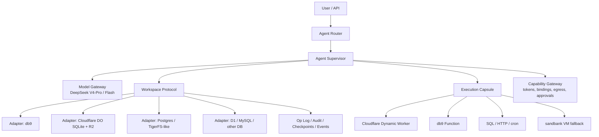

# DB-native Agent Harness 研究：脱离虚拟计算空间绑定的 Agent 是否可行

日期：2026-05-27  
问题来源：围绕 Willow、TigerFS、db9.ai、Cloudflare Dynamic Workers、DeepSeek V4-Pro，以及「计算空间 workspace 是否必须和 agent 绑定」这组问题做一次工程判断。

## 结论摘要

可行，但需要把命题说清楚：

**不可行的版本**：完全没有计算空间的 agent。LLM 推理、权限检查、调度、代码运行、SQL 执行、网络请求仍然需要计算资源。

**可行的版本**：agent 的身份、状态、workspace、文件、op log、能力边界、恢复点不再绑定到某个 VM/container/sandbox；计算只作为短生命周期的执行胶囊出现，可以是 Cloudflare Dynamic Worker、Durable Object、db9 Function、数据库内置函数、或者必要时回退到 sandbank/VM。

推荐的产品定义是：

> DB-native agent harness = 以数据库为 agent 的 durable workspace 和 capability substrate，以临时 compute capsule 执行模型调用与工具调用。agent 绑定的是 DB workspace protocol，不是虚拟计算空间。

当前 Sandbank 的产品定义已经扩展为统一的 Workspace Agent Harness：DB-native harness 是其中一种后端形态，Sandbank Cloud（托管 BoxLite，推荐默认 provider）、Dynamic Worker、E2B、本地 BoxLite、Fly.io、Daytona、Cloudflare Workers 等都是可调度的执行 capsule。Workspace protocol 是跨后端的权威状态层，provider scheduler 负责在多个后端沙盒之间 materialize/sync/merge 工作任务。

这和你推文里的直觉一致：过去把基本 op 映射到网络资源，今天更好的抽象是把 op 映射到「数据库内的资源、文件、事务、事件、函数、权限与历史」。SOTA 模型第一层 harness 进步后，虚拟化仍有价值，但不必是 agent identity 的唯一载体。

## 术语定义

**Workspace-bound agent**  
agent 的长期身份和状态主要活在一个虚拟计算空间里，例如 VM/container/sandbox 的文件系统、进程环境、依赖、临时目录和运行时权限。

**DB-native agent**  
agent 的长期身份和状态主要活在数据库里，包括文件视图、任务队列、历史、权限、索引、向量、op log、checkpoint、artifact。运行时 compute 可以随时销毁和重建。

**Execution capsule**  
短生命周期执行单元。它可以运行 JS/TS、SQL、HTTP tool、model call、少量 WASM 或受限 shell，但不被视为 agent 的 durable home。

**Workspace protocol**  
harness 暴露给模型和工具的稳定接口，例如 `read`、`write`、`list`、`query`、`diff`、`checkpoint`、`rollback`、`watch`、`invoke`。底层可由不同 database backend 实现。

## 关键判断

1. 这个方向的核心不是「把 shell 搬进 DB」，而是「把 agent 可见世界变成 DB 里的可审计对象」。
2. TigerFS 证明了 filesystem 可以是数据库 API；db9 证明了 agent skill 可以把数据库变成 agent 操作系统；Willow 证明了 agent workspace 需要历史、恢复和并发友好的持久状态；Cloudflare 证明了 compute 可以被压成临时、受限、按需加载的 capsule。
3. 如果产品目标是摆脱 sandbank 对 VM 的强绑定，应先做 DB-native harness，而不是试图一次性替代所有 VM 任务。
4. 多数据库支持是可行的，但必须采用 capability matrix，不要假设所有数据库都有 fs、watch、branch、vector、cron、function runtime。
5. db9 是目前最接近「DB 里运行 agent workspace」的现成系统之一，但它更适合作为强 backend/prototype，不应把 harness 设计绑定死在 db9 私有能力上。

## Evidence 1：Willow 的启发

Willow 文章的核心点是：agent 会制造熵，workspace 需要可回溯、可恢复、可并发的历史结构。SQLite/数据库化文件系统适合 agent，因为：

- agent 的 state、history、filesystem 可以被持久化在数据库里；
- 每个 agent 可以拥有独立数据库或独立历史；
- agent loop 很多时间在等待模型，天然适合并发；
- append-only/history/time-travel 能显著降低模型误操作的破坏半径；
- mvSQLite 这类方向把存储和计算分离，使 compute 不再必须持有 durable filesystem。

工程推论：Willow 不是在说「不需要 compute」，而是在说 agent 的 durable world model 可以数据库化。我们要吸收的是：identity/state/filesystem/history 归数据库，执行进程只负责临时推进状态。

来源：[Willow](https://su3.io/posts/willow)

## Evidence 2：TigerFS 的启发

TigerFS 的 README 把它定义为「PostgreSQL backed filesystem」以及「filesystem interface to PostgreSQL」。它的价值在于反转接口：

- 文件是 PostgreSQL 行；
- 目录是表；
- 文件内容可以映射成列；
- 多个 agent/human 可以通过标准文件工具并发读写；
- 变更可版本化、可恢复；
- filesystem 本身就是 API；
- data-first 模式可以把 path pipeline 下推成 SQL 查询。

特别值得借鉴的能力：

- file-first：Markdown、frontmatter、`.history/`、`.log/`、`.savepoint/`、`.undo/`；
- data-first：把 row/table/index 暴露成目录和文件；
- path query：例如 `.by/customer_id/123/.order/created_at/.last/10/.export/json`；
- history：edit/delete snapshot、savepoint、undo；
- backend prefix：`tiger:`、`ghost:`、`postgres://` 这类可扩展地址方案。

限制也很清楚：

- TigerFS 当前本质上是 PostgreSQL/Timescale 生态，不是多数据库通用抽象；
- 它依赖 PostgreSQL schema、pg_catalog、trigger、extension、Timescale hypertable 等语义；
- Cloudflare Worker/Dynamic Worker 不适合直接跑 FUSE mount；
- 但 TigerFS 的「filesystem/path as API」非常适合作为 harness 协议设计参考。

工程推论：不要把 TigerFS 作为所有后端的统一实现，而是借鉴它的 path grammar、history namespace 和 data-first/file-first 双视图。

来源：[timescale/tigerfs README](https://github.com/timescale/tigerfs/blob/main/README.md)、[file-first](https://github.com/timescale/tigerfs/blob/main/docs/file-first.md)、[data-first](https://github.com/timescale/tigerfs/blob/main/docs/data-first.md)、[history](https://github.com/timescale/tigerfs/blob/main/docs/history.md)、[backend prefix ADR](https://github.com/timescale/tigerfs/blob/main/docs/adr/013-backend-prefix-scheme.md)

## Evidence 3：db9.ai 与它的 skill

db9 的公开定位是「serverless Postgres for AI agents」。架构上，它提供 PostgreSQL wire protocol，背后是 TiKV-backed storage/data plane，并内置 agent 友好的扩展能力。

db9 最重要的不是某个单点功能，而是它的 `skill.md`：它把数据库能力转写成 agent 可以可靠调用的操作手册。这对 DB-native harness 很关键，因为 agent 不只需要 API，还需要可学习、可审计、可约束的 action grammar。

### db9 skill 暴露的 agent-native 能力

db9 skill 的核心 metadata：

- API base：`https://api.db9.ai`
- pg host：`pg.db9.io`
- pg port：`5433`
- description：serverless Postgres for AI agents，内置 JSONB、vector search、HTTP from SQL、fs9、cron、full-text search。

对 DB-native harness 最相关的能力：

- **Scoped tokens**：可创建 database-specific `ro/rw` token；只读 token 允许 SELECT、fs read、functions history/list，阻止 SQL write、fs write、function deploy/invoke、secrets、db create/delete。
- **fs9 filesystem**：每个 database 有 TiKV-backed filesystem；支持 `fs9_read`、`fs9_write`、`fs9_append`、`fs9_exists`、`fs9_remove`、`fs9_mkdir` 等 SQL scalar functions。
- **fs9 table function**：`extensions.fs9('/path')` 可把 CSV、JSONL、TSV、text、Parquet 等文件读成 SQL table。
- **filesystem shell / sh9**：提供 `ls`、`cat`、`cp`、`mv`、`rm`、`find`、`grep`、`jq`、`diff`、`patch`、`tree`、pipe、redirection 等 POSIX-like 交互。
- **file watch**：`db9 fs watch <db>:/path` 监听文件事件，skill 里直接给了 inter-agent messaging 的模式：一个 agent 写 `/messages/inbox-b/task-001.json`，另一个 agent watch、读取、处理、写 result、删除 task。
- **serverless functions**：可部署 JS/TS 函数，有 `history`、`logs`、`secrets`、`fs9-scope /path:ro|rw`、limits、visibility、invoke API。
- **function runtime ctx**：公开 docs 描述 `ctx.db` 做 SQL、`ctx.fs9` 做 filesystem、`ctx.self` 做 metadata；这非常接近 database-adjacent execution capsule。
- **cron**：`pg_cron` 能 schedule SQL，也能通过 `SERVERLESS_FUNCTIONS.INVOKE(function_name, payload)` 调函数。
- **HTTP extension**：SQL 内可发 HTTPS GET/POST/PUT/DELETE，适合 enrichment/webhook/tool integration；skill 中写有 SSRF 防护、HTTPS-only、max calls、body limits 等约束。
- **vector search / embedding**：pgvector-compatible `vector(n)`、HNSW/IVFFlat、内置 embedding 函数。
- **full-text search**：支持 PostgreSQL-compatible FTS，并包括 Chinese tokenizer / ngram / phrase/ranking/highlighting。
- **branch/PITR**：支持 database branch 和 point-in-time branch；TiKV snapshot restore 可用时走 fast path，否则 fallback 到 logical clone。
- **REST API**：db create/list/delete、schema、observability、branch、fs-connect、functions、secrets、tokens、audit logs。

### db9 对本问题的意义

db9 基本已经提供了「DB as agent substrate」的很多原语：

- database = workspace identity；
- fs9 = durable file workspace；
- tables = structured memory/task queue；
- vector/FTS = retrieval substrate；
- functions = database-adjacent execution capsule；
- cron = periodic/self-triggered agent loop；
- fs watch = inter-agent/event bus；
- branch/PITR = experiment/rollback；
- scoped token = capability boundary；
- skill.md = agent action grammar。

这说明「agent 跑在数据库里」不是纯理论概念。更准确地说，db9 让 agent 的 workspace、事件、文件、任务、检索、部分计算都可以数据库化；模型推理和复杂执行仍在外部或函数 capsule 中。

### db9 的风险和边界

需要谨慎处理：

- skill 明确提示 pgwire wire-level TLS 当前未强制；不要直接把敏感数据通过未加密 pgwire 暴露在不可信网络上，优先 HTTPS API、私网/VPN 或等待 TLS 路线成熟；
- DB9 SQL 是 PostgreSQL-compatible subset，不是完整 PostgreSQL；
- architecture docs 显示 Serializable isolation 不支持，默认更接近 TiKV MVCC/Snapshot Isolation；
- 部分 GIN/runtime 执行、logical replication、FDW、custom C extensions 等能力有限；
- fs9 文件/请求大小有上限，bulk ingest 应使用 COPY，而不是 fs upload + fs9 insert；
- db9 实现主体不是完全公开 repo；应把它当作 backend/provider，不要让 harness 的核心协议依赖私有实现细节。

来源：[db9 skill.md](https://db9.ai/skill.md)、[db9 overview](https://db9.ai/docs/overview/)、[db9 architecture](https://db9.ai/docs/architecture/)、[db9 functions runtime](https://db9.ai/docs/functions/runtime/)、[db9 examples](https://github.com/db9-ai/db9-examples)、[db9 fs + Claude Code Docker example](https://github.com/db9-ai/db9-fs-fuse-docker-example)

## Evidence 4：Cloudflare Dynamic Workers / Durable Objects / Agents

Cloudflare 的价值在于把 compute 做成临时、受限、可动态加载的执行 capsule。

关键能力：

- **Dynamic Workers**：可在 runtime 加载并运行 Worker code；`load()` 适合一次性执行，`get(id)` 适合稳定标识与复用，但不能依赖同一个 isolate 或内存状态。
- **Bindings**：capability-based。dynamic worker 只看到 supervisor 传入的 bindings。
- **Egress control**：可用 `globalOutbound: null` 阻止直接外网，或通过受控 gateway 统一审计网络访问。
- **Custom limits**：可设置 CPU/subrequest 等限制。
- **Durable Object Facets**：dynamic code 可拿到受 supervisor 控制的 Durable Object/SQLite storage。
- **Durable Objects + SQLite storage**：适合做 durable agent identity、state、queue、checkpoint。
- **Agents SDK**：Cloudflare agent 是 durable identity，不是永远在线进程；state/schedule/checkpoint 可保留，in-memory/open fetch 不应作为 durable state。

限制：

- Workers 内存、CPU 和运行时能力有限；不适合本地 LLM/GPU、大型编译、浏览器自动化、复杂 native dependency；
- 不支持 FUSE；
- 对 PostgreSQL/MySQL 等外部数据库可通过 Hyperdrive/HTTP API/driver 连接，但要关注连接、latency、事务和 pooling。

工程推论：Cloudflare Dynamic Worker 很适合作为 DB-native harness 的「临时工具执行层」，而 Durable Object/SQLite/D1/R2 可以做 edge-native 默认 backend。它不应该承载 agent 的长期文件系统身份。

来源：[Dynamic Workers Getting Started](https://developers.cloudflare.com/dynamic-workers/getting-started/)、[Dynamic Workers API](https://developers.cloudflare.com/dynamic-workers/api-reference/)、[Bindings](https://developers.cloudflare.com/dynamic-workers/usage/bindings/)、[Egress control](https://developers.cloudflare.com/dynamic-workers/usage/egress-control/)、[Custom limits](https://developers.cloudflare.com/dynamic-workers/usage/limits/)、[Durable Object Facets](https://developers.cloudflare.com/dynamic-workers/usage/durable-object-facets/)、[Durable Objects SQLite storage](https://developers.cloudflare.com/durable-objects/api/sqlite-storage-api/)、[Long-running agents](https://developers.cloudflare.com/agents/concepts/long-running-agents/)、[Workers limits](https://developers.cloudflare.com/workers/platform/limits/)

## Evidence 5：DeepSeek V4-Pro

DeepSeek V4-Pro 的角色不应是「运行在 Cloudflare Worker 里」。它应作为 planner/coder/reasoner model，通过 API 被 harness 调用。

建议分工：

- V4-Pro：高价值规划、代码生成、复杂 tool selection、跨文件推理；
- V4-Flash 或更便宜模型：短循环、分类、状态摘要、简单 routing；
- harness：负责 state、capability、execution、rollback、audit；
- database：负责 durable workspace、op log、event、retrieval、branch。

工程推论：模型越强，越应该把第一层 harness 做窄、硬、可审计。不要把数据库凭据、长期权限、未过滤网络直接交给模型。

来源：[DeepSeek V4-Pro release](https://api-docs.deepseek.com/news/news260424)、[DeepSeek pricing/models](https://api-docs.deepseek.com/quick_start/pricing)、[DeepSeek rate limits](https://api-docs.deepseek.com/quick_start/rate_limit/)

## 建议架构



### 核心组件

**Agent Supervisor**  
保存 agent identity、run state、model loop、tool selection、policy check。可以跑在 Cloudflare Durable Object、普通 service、或现有 sandbank control plane 中。

**Workspace Protocol**  
唯一稳定抽象。模型和 tool 不直接依赖某个 DB 的私有 API。

**Backend Adapter**  
把 protocol 映射到 db9、DO SQLite、Postgres/TigerFS、D1、R2/S3、MySQL 等后端。

**Execution Capsule**  
临时运行代码和工具。首选 Cloudflare Dynamic Worker 或 db9 Function；遇到 POSIX/native/browser/large build 时回退 sandbank。

**Capability Gateway**  
集中处理 token scope、egress、network allowlist、secrets、approval、rate limit。

**Op Log / Checkpoint**  
所有模型动作、工具调用、文件变更、SQL 变更、外部副作用都进入 append-only log。

## Workspace Protocol 草案

最小接口：

```ts
interface Workspace {
  list(path: string, opts?: ListOptions): Promise<Entry[]>;
  read(path: string, opts?: ReadOptions): Promise<Blob | Text>;
  write(path: string, data: Blob | Text, opts?: WriteOptions): Promise<WriteResult>;
  append(path: string, data: Blob | Text): Promise<WriteResult>;
  remove(path: string, opts?: RemoveOptions): Promise<void>;
  move(from: string, to: string): Promise<void>;
  stat(path: string): Promise<EntryMetadata>;

  query(expr: WorkspaceQuery): Promise<QueryResult>;
  transaction<T>(fn: (tx: WorkspaceTx) => Promise<T>): Promise<T>;

  checkpoint(label?: string): Promise<Checkpoint>;
  diff(a: Ref, b: Ref): Promise<Diff>;
  rollback(ref: Ref): Promise<void>;

  watch(path: string, opts?: WatchOptions): AsyncIterable<WorkspaceEvent>;
  lock(resource: string, ttlMs: number): Promise<Lock>;

  log(op: AgentOp): Promise<OpId>;
}
```

推荐 namespace：

- `/files/...`：durable file workspace；
- `/tables/...`：structured data view；
- `/messages/inbox/<agent>/...`：inter-agent task/message bus；
- `/.history/...`：historical snapshots；
- `/.log/...`：op log；
- `/.savepoint/...`：explicit checkpoint；
- `/.undo/...`：rollback target；
- `/.branches/...`：branch/experiment workspace；
- `/.caps/...`：capability grants；
- `/.runs/...`：model/tool execution runs；
- `/.artifacts/...`：user-visible outputs。

可借鉴 TigerFS/db9 的 path query 语法：

- `/tables/orders/.by/customer_id/123`
- `/tables/orders/.order/created_at/.last/10`
- `/files/data/*.jsonl/.where/level=error`
- `/messages/inbox/planner/.watch`
- `/.history/runs/2026-05-27T09:00:00Z`

## 多数据库支持策略

多数据库支持应该是 adapter + capability matrix，不是 lowest-common-denominator。

| Backend | 适合程度 | 可提供能力 | 主要限制 |
|---|---:|---|---|
| db9 | 很高 | SQL、fs9、watch、functions、cron、vector、FTS、branch、scoped token | pgwire TLS 风险、Postgres subset、私有实现、文件/请求限制 |
| Postgres + TigerFS-like | 高 | SQL、事务、schema introspection、file/data 双视图、history、丰富生态 | 需要额外服务/FUSE 或 API 层；TigerFS 当前偏 Postgres/Timescale |
| Cloudflare DO SQLite | 高 | durable state、SQLite、PITR、edge locality、supervisor identity | 单 DO 边界、无 FUSE、复杂查询/跨 workspace 分析弱 |
| Cloudflare D1 + R2 | 中高 | SQL + blob、edge-friendly、成本低 | watch/transaction/history 要自建；D1 不是完整 Postgres |
| MySQL/Postgres via Hyperdrive | 中 | 接已有业务数据库，做 structured memory/query | file workspace、branch、watch、vector/FTS 差异大 |
| S3/R2 + metadata DB | 中 | 大文件、artifact、cheap blob storage | 事务、query、history、watch 要由 metadata 层补齐 |
| SQLite/libSQL/Turso | 中 | 轻量、复制、edge/local-friendly | 多 agent 并发、函数、watch、branch 能力取决于 provider |
| FoundationDB/TiKV/custom KV | 高但重 | 强事务、可做统一 substrate | 需要自研 SQL/filesystem/agent API 层 |

设计原则：

1. 所有 backend 实现同一个 `Workspace` protocol。
2. 每个 backend 声明 capabilities，不支持的能力由 harness fallback 或禁用。
3. 模型只看到 harness 允许的能力，不直接看到裸 DB credentials。
4. 高级能力不要伪装成通用能力。例如 `branch`、`watch`、`function runtime`、`HTTP from SQL` 应明确标注 provider-specific。

Capability matrix 示例：

| Capability | db9 | Postgres/TigerFS | DO SQLite | D1/R2 | MySQL |
|---|---:|---:|---:|---:|---:|
| atomic write | Yes | Yes | Yes | Partial | Yes |
| SQL query | Yes | Yes | Yes | Yes | Yes |
| file API | Yes | Yes | Custom | Custom | Custom |
| file as table | Yes | Yes | Custom | Custom | No |
| watch/events | Yes | Custom | Yes/custom | Custom | Custom |
| branch/PITR | Yes | Provider-dependent | PITR | Partial | Provider-dependent |
| vector search | Yes | pgvector | External | Vectorize/external | External |
| full-text search | Yes | Yes | SQLite FTS | D1 FTS/custom | Yes/custom |
| cron | Yes | pg_cron/custom | Alarms | Cron Triggers | Custom |
| function runtime | Yes | Custom | Dynamic Worker | Worker | Custom |
| scoped token | Yes | RLS/roles/custom | bindings/custom | bindings/custom | roles/custom |

## db9-first MVP

这是最快验证「database-native workspace」的路径。

### 数据模型

在一个 db9 database 中创建：

- `agent_runs`：run id、model、status、started_at、ended_at、summary；
- `agent_ops`：append-only op log，记录 model thought summary、tool call、SQL、file write、external request；
- `agent_tasks`：task queue，含 status、lease、retry、priority；
- `agent_messages`：agent 间消息索引；
- `agent_caps`：capability grants，映射到 db9 scoped token、function fs9-scope、network allowlist；
- fs9 `/workspace/...`：文件与 artifact；
- fs9 `/messages/inbox/...`：事件触发与 inter-agent messaging；
- vector/FTS tables：workspace search。

### 执行路径

1. User request 写入 `agent_tasks` 与 `/messages/inbox/supervisor/...`。
2. Supervisor 读 workspace summary，调用 DeepSeek V4-Pro。
3. 模型输出受限 op，例如 `workspace.write`、`workspace.query`、`function.invoke`。
4. Harness 验证 capability。
5. 小型数据任务直接 SQL/fs9 执行。
6. 需要代码时部署或调用 db9 Function，限制 `--fs9-scope /workspace:rw`、network allowlist、timeout、secrets。
7. 所有变更进入 `agent_ops`。
8. 通过 db9 branch 或 checkpoint 做试验和 rollback。

### 为什么 db9-first 值得做

- 它已经提供 fs、SQL、function、cron、watch、vector、FTS；
- skill 直接给了 agent 操作语法；
- inter-agent messaging 可以直接用 fs watch 验证；
- 不需要先自研完整 database filesystem；
- 可以快速发现 DB-native harness 的真实痛点：latency、权限、side effect、rollback、file size、model ergonomics。

## Cloudflare-first MVP

这是更接近「不绑定虚拟计算空间」的边缘产品路径。

### 组件

- Durable Object：每个 agent/workspace 一个 durable identity；
- DO SQLite：保存 op log、tasks、metadata、small files；
- R2：保存大文件/artifacts；
- Dynamic Worker：临时代码执行 capsule；
- Egress gateway：统一网络访问；
- DeepSeek V4-Pro：planner/coder；
- Vectorize 或外部 vector DB：可选 retrieval。

### 执行路径

1. User request 进入 DO。
2. DO 读取 SQLite/R2 workspace state。
3. DO 调模型。
4. 模型产出受限 op。
5. DO 按 capability 调 Dynamic Worker。
6. Dynamic Worker 只收到必要 bindings，比如只读 workspace binding、R2 prefix、受控 fetch。
7. 结果写回 DO SQLite/R2 和 op log。

### 适用

- 高并发轻量 agent；
- 没有 POSIX/FUSE/native dependency 的任务；
- 需要强租户隔离、低运维、全球边缘执行；
- 希望把 compute 压成极短生命周期 capsule。

## 与 sandbank/VM 的关系

DB-native harness 不应该一次性替代 sandbank。

保留 VM fallback 的任务：

- 需要 POSIX shell 和真实文件系统语义；
- 需要浏览器自动化；
- 需要大型编译、native dependency、Docker、包管理器；
- 需要长时间 CPU/GPU；
- 需要运行用户提供的复杂二进制。

DB-native 优先的任务：

- 读写文档、结构化数据、日志、CSV/JSONL；
- 数据清洗和小型 ETL；
- RAG/index/search；
- agent 之间任务传递；
- cron/autonomous monitoring；
- 低风险代码生成与 artifact 生成；
- 可 rollback 的数据/文件 workspace。

产品上可以把 sandbank 变成一种高级 execution capsule，而不是 agent 的默认身份。

## 安全模型

最低要求：

- 模型永远不直接持有 admin DB credential；
- 所有 tool call 通过 capability gateway；
- DB token 使用 scoped `ro/rw`，按 workspace/agent/run 细分；
- function 使用 fs9-scope 或等价 path scope；
- egress 默认 deny，按 domain/route allowlist；
- secrets 只绑定给 function/capsule，不进入 prompt；
- 所有外部副作用写 op log；
- destructive op 需要 checkpoint 或 approval；
- rollback 只能回滚 DB workspace 内的状态，不能假装回滚已发生的外部副作用。

db9 特别注意：

- pgwire TLS 当前未强制时，不要让 agent 通过公网 pgwire 发送敏感 payload；
- 优先 HTTPS API 或受控私网；
- scoped token 是必须项，不是增强项。

Cloudflare 特别注意：

- Dynamic Worker 不应拿到全局 outbound；
- bindings 应最小化；
- Durable Object 内存状态不能当 durable source of truth；
- worker limits 要进入 scheduler 的成本/超时模型。

## 推荐实现路线

### Sandbank 仓库落地包命名

在 Sandbank 中不建议新增以 `db-native` 命名的包。`DB-native` 应保留为架构范式，不应变成包名。包名应该按职责表达稳定边界：

| 包/目录 | npm 包名 | 职责 |
|---|---|---|
| `packages/workspace` | `@sandbank.dev/workspace` | Workspace protocol、文件/表/消息/历史/checkpoint/watch 抽象、capability matrix、backend-neutral tests |
| `packages/agent` | `@sandbank.dev/agent` | 扩展现有 agent client，使 agent 能通过 workspace API 读写 durable state、提交 op、读取任务和 artifact |
| `packages/core` | `@sandbank.dev/core` | 仅在接口稳定后上移最小公共类型，例如 `WorkspaceBinding`、`ExecutionCapsuleBinding` |
| `packages/db9` | `@sandbank.dev/db9` | 在现有 ServiceAdapter 基础上新增 `Db9WorkspaceAdapter`，实现 fs9、SQL、watch、branch、function invoke |
| `packages/cloudflare` | `@sandbank.dev/cloudflare` | 增加 DO SQLite/R2/Dynamic Worker workspace adapter，不把 Cloudflare 细节泄漏到 workspace protocol |
| `packages/boxlite` | `@sandbank.dev/boxlite` | 继续作为重型 execution capsule，负责 Node build、ffmpeg、browser、native deps 等 DB 内不适合执行的任务 |
| `packages/sandbank` | `sandbank` CLI | 暴露 workspace 创建、run、checkpoint、watch、materialize、capsule invoke 等命令 |

推荐依赖方向：

```text
@sandbank.dev/agent
  -> @sandbank.dev/workspace
  -> @sandbank.dev/core

@sandbank.dev/db9
  -> @sandbank.dev/workspace
  -> @sandbank.dev/core

@sandbank.dev/cloudflare
  -> @sandbank.dev/workspace
  -> @sandbank.dev/core

@sandbank.dev/boxlite
  -> @sandbank.dev/core
```

第一阶段不要把 workspace protocol 直接塞进 `@sandbank.dev/core`。先放在 `@sandbank.dev/workspace` 内快速迭代，等接口稳定后再把最小类型上移到 core。这样可以避免影响现有 sandbox provider API，也能让 db9、Cloudflare、Postgres/TigerFS-like backend 独立演进。

后续 agent 执行计划可以按以下任务拆分：

1. 在 `packages/workspace` 创建最小协议：`Workspace`、`WorkspaceAdapter`、`WorkspaceCapabilities`、`WorkspaceEvent`、`Checkpoint`、`OpLogEntry`。
2. 在 `packages/workspace` 做 `MemoryWorkspaceAdapter`，用于单元测试和 API 收敛。
3. 在 `packages/db9` 增加 `Db9WorkspaceAdapter`，优先实现 `read/write/list/stat/remove/query/watch`。
4. 在 `packages/agent` 增加 workspace client helper，让 sandbox 内外 agent 使用同一组 workspace op。
5. 在 `packages/sandbank` CLI 增加 `sandbank workspace ...` 命令，用于创建、查看、watch、materialize、checkpoint。
6. 选择 `visi0` 或 `codeben` 做第一个 dogfood，但不要把通用协议放进业务仓库。

实施备注：本仓库第一阶段只落地通用 protocol、memory/db9 adapter、agent helper 与 CLI。第 6 步 dogfood 不在 sandbank 仓库内改业务代码；后续应在 `visi0` 或 `codeben` 中选择一个低风险任务，把 `@sandbank.dev/workspace` 作为外部依赖接入，并用真实 agent run 验证 task/artifact/checkpoint 流程。

### Phase 0：协议和评测

先实现 provider-neutral `Workspace` protocol，并定义 capabilities。

评测任务：

- 写入/读取/移动/删除文件；
- SQL query + file as table；
- inter-agent message；
- checkpoint + rollback；
- branch + test + merge/discard；
- vector search over workspace；
- function/capsule 执行；
- egress deny/allow；
- token scope 越权测试。

### Phase 1：db9 adapter

实现：

- `Workspace.read/write/list/stat/remove` -> fs9 scalar/API；
- `Workspace.query` -> SQL；
- `watch` -> `fs watch` 或 REST/WebSocket fs-connect；
- `checkpoint/branch` -> db9 branch/PITR 或自建 op log checkpoint；
- `invoke` -> db9 functions；
- `search` -> vector/FTS；
- `caps` -> scoped tokens + function fs9-scope。

目标：快速证明 DB-native workspace 的产品体验。

### Phase 2：Cloudflare adapter

实现：

- DO SQLite metadata/op log；
- R2 blob store；
- Dynamic Worker execution capsule；
- egress gateway；
- DO alarms/Cron triggers；
- optional D1/Vectorize。

目标：证明不依赖固定 VM/container 的 edge-native harness。

### Phase 3：Postgres/TigerFS-like adapter

实现：

- Postgres tables + object storage 或 TigerFS-compatible path view；
- `.history/.savepoint/.undo`；
- pgvector/FTS；
- LISTEN/NOTIFY 或 logical/event table watch；
- pg_cron/custom worker。

目标：服务已有 Postgres/Supabase/Neon/Timescale 用户，并验证「支持不同 database」的商业路径。

## 关键开放问题

1. db9 Function runtime 的实际隔离、网络 allowlist、资源限制、冷启动、并发模型需要实测。
2. db9 pgwire TLS 路线和当前生产可用安全边界需要确认。
3. fs9 watch 的一致性、去重、cursor/resume 语义需要实测。
4. branch/PITR 能否同时覆盖 SQL rows、fs9 files、function metadata、secrets、cron job，需要确认。
5. Cloudflare Dynamic Worker 对动态代码包大小、依赖、CPU、subrequest、网络代理的限制需要进入 scheduler。
6. 多数据库 adapter 的 merge/rollback semantics 必须统一，否则模型会产生错误预期。
7. 外部副作用不可回滚，必须用 saga/compensation/approval 表达。

## 最终建议

建议把产品设计成：

**DB-native workspace protocol + 多 backend adapter + ephemeral execution capsule。**

优先做两个 backend：

1. **db9-first prototype**：最快验证「agent workspace 跑在数据库里」的完整体验。
2. **Cloudflare-first runtime**：验证「agent 不绑定虚拟计算空间」的边缘计算形态。

DeepSeek V4-Pro 作为 planner/coder，V4-Flash 或轻量模型作为 loop/router。sandbank 作为 VM fallback，而不是默认 agent identity。

这样设计后，你的问题可以回答为：

> 理论上存在不绑定虚拟计算空间的 agent；实践上它不是没有 compute，而是把 durable workspace 和 agent identity 绑定到 DB，把 compute 降级为可替换、可销毁、受限的 capsule。db9 和 TigerFS 分别证明了 DB-as-filesystem 与 DB-as-agent-skill 的可行性；Cloudflare Dynamic Workers 则提供了把执行层虚拟化到极薄的方式。

## 资料与置信度

| 结论/事实 | 来源 | 置信度 | 备注 |
|---|---|---:|---|
| Willow 强调 agent workspace 需要数据库化历史、恢复、并发 | [Willow](https://su3.io/posts/willow) | 0.75 | 博客论证，工程方向可信但非规范文档 |
| TigerFS 是 PostgreSQL-backed filesystem，文件/目录映射到 DB 对象 | [TigerFS README](https://github.com/timescale/tigerfs/blob/main/README.md) | 0.85 | GitHub 项目文档 |
| TigerFS 当前强依赖 PostgreSQL/Timescale 语义 | [DB interfaces](https://github.com/timescale/tigerfs/blob/main/internal/tigerfs/db/interfaces.go) | 0.85 | 从接口和 docs 推断 |
| db9 提供 fs9、functions、cron、vector、FTS、HTTP-from-SQL、branch | [db9 skill.md](https://db9.ai/skill.md) | 0.9 | 官方 skill，2026-05-27 复核 |
| db9 architecture 是 pgwire + TiKV keyspace，多租户隔离 | [db9 architecture](https://db9.ai/docs/architecture/) | 0.85 | 官方 docs |
| db9 skill 提到 pgwire TLS 当前未强制 | [db9 skill.md](https://db9.ai/skill.md) | 0.9 | 关键安全风险 |
| db9 examples 包含 Cloudflare Worker CRUD/RAG | [db9 examples](https://github.com/db9-ai/db9-examples) | 0.8 | GitHub examples |
| Cloudflare Dynamic Workers 可动态加载 Worker code，并通过 bindings/egress/limits 约束 | [Dynamic Workers docs](https://developers.cloudflare.com/dynamic-workers/getting-started/) | 0.85 | 官方 docs |
| Durable Objects/Agents 适合 durable identity，不应依赖内存作为 durable state | [Cloudflare long-running agents](https://developers.cloudflare.com/agents/concepts/long-running-agents/) | 0.85 | 官方 docs |
| DeepSeek V4-Pro 适合作为 planner/coder API，而非 Worker 内本地模型 | [DeepSeek release](https://api-docs.deepseek.com/news/news260424) | 0.8 | 官方 docs + 架构推断 |
| DB-native agent 不等于无 compute，而是 durable workspace 与 compute 解耦 | 本文综合推断 | 0.7 | 需要 prototype 验证 latency、安全、rollback |
