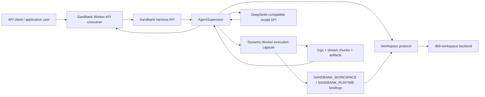

# Dynamic Worker Harness Architecture

The DB-native harness keeps durable agent identity and state in the workspace backend. Dynamic Workers are ephemeral execution capsules used for bounded tool code, not durable state and not shell or VM execution.

## Roles

- `API client`: any application, UI, automation, or service that sends agent turns to the Sandbank harness API.
- `Sandbank harness API`: HTTP/SSE boundary for external callers, run orchestration, model calls, and deployment surface.
- `AgentSupervisor`: owns run state, policy checks, audit events, checkpoints, and tool dispatch.
- `Workspace protocol`: stable capability interface for read/write/append/list/query/log/checkpoint.
- `db9`: durable workspace backend. Run files, agent state, audit logs, and artifacts live here.
- `Dynamic Worker execution capsule`: short-lived or reusable code runner. It receives only allowlisted bindings and has outbound network denied by default.
- `SANDBANK_WORKSPACE`: scoped binding exposing workspace operations to Dynamic Worker code.
- `SANDBANK_RUNTIME`: runtime binding for logs and artifacts.
- `DeepSeek-compatible model API`: generates the final user-facing answer. It does not receive raw db9 credentials.

## Current Boundary

Dynamic Workers execute bounded tool code through bindings. They do not provide a shell, container, VM filesystem, native package installation, browser automation, or long-running durable agent identity.
